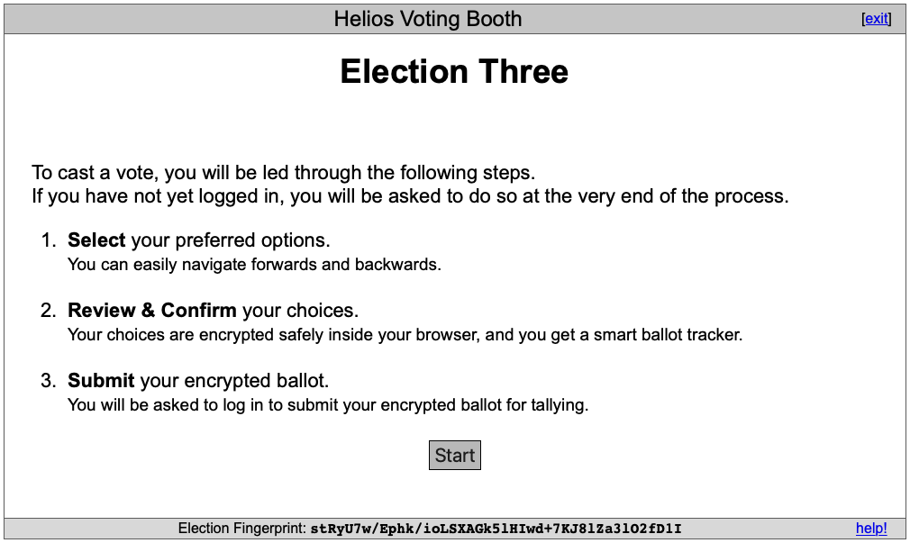

# Overview

This section on "How it works" is based on Ben Adida's documentation, my own experience with trying it out and my reading of the academic literature.  My aim is for it to be helpful for the general user (as opposed to a cryptographic expert who should consult the [academic literature](../ref_literature) instead). Nevertheless, the cryptographic aspects are key security features and I will do my best to explain their implementation in lay-person terms.

The following is a very brief summary of the key screens:

- election setup
- voting booth
- election results.

## Election setup

The election administrator: 

- visits the election site (eg https://vote.heliosvoting.org) 
- logs in
- sets up the election.

If the administrator sets up the election for only those voters whose names are uploaded, the server sends an email to each voter. The email contains the election url, fingerprint and the log-in id and password of the voter.

#### What the administrator sees


#### What the administrator sees after logging in


## Voting

The voter:

- visits the link in the emaiil
- is presented with the voting booth
- selects their choices
- submits their ballot to the server.

The email the voter receives contains:

```
Election URL: https://helios.wrmack.com/helios/e/Election_three/vote
Election Fingerprint: stRyU7w/Ephk/ioLSXAGk5lHIwd+7KJ8lZa3lO2fD1I

Your voter ID: ********
Your password: ********
```

#### What the voter sees after clicking the election url



The url is of the form:    

```
https://[helios site]/booth/vote.html?election_url=%2Fhelios%2Felections%2F9a9f4d4a-802a-11eb-ad7a-0e2e98b7568d
```

## Election results

Once voting is over, the election administrator causes the votes to be tallied.  The election administrator can send an email to each voter giving them a link to this screen:

